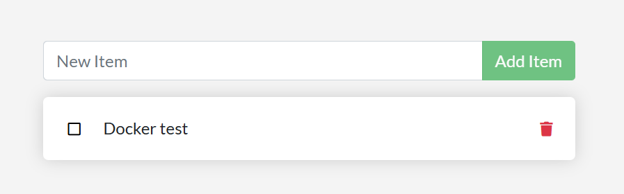
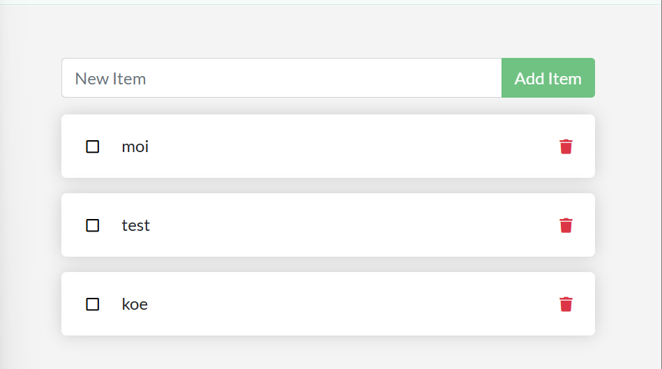

# Docker & kontit

Tämä on yksinkertainen Docker-harjoitusprojekti. Teimme Node.js + Express -todo-sovelluksen ja ajamme sen Docker-kontissa.

## Mitä teimme?

- Asensimme Dockerin
- Käynnistimme sovelluksen paikallisesti
- Rakensimme Dockerin kuva
- Käytimme Docker Composea
- Testasimme sovelluksen toiminnan selaimessa

## Teknologiat

- Node.js
- Express
- SQLite
- Docker
- Docker Compose

## Käynnistys

Asenna riippuvuudet:

```bash
npm install
```

Käynnistä sovellus:

```bash
npm run dev
```

Avaa selaimessa:

```text
http://localhost:3000
```

## Docker

Rakenna ja käynnistä:

```bash
docker compose up --build
```

## Kuvakaappaus




## Yhteenveto

Harjoituksen jälkeen opimme Dockerin peruskäytön, konttien käynnistyksen ja sovelluksen ajamisen Dockerissa.

* Docker Init -toimintoa käytettiin Docker-konfiguraation luomiseen.
* Dockerfile käytiin läpi ja sitä muokattiin sovellukselle sopivaksi.
* `compose.yaml` käytiin läpi ja sitä muokattiin.
* `README.Docker.md` tarkistettiin.
* Express-palvelimen host-osoitteeksi muutettiin `0.0.0.0`.
* Docker-image rakennettiin ja sovellus käynnistettiin kontissa.
* Docker Compose Watch otettiin käyttöön.
* Sovelluksen toiminta testattiin selaimessa.
* MongoDB lisättiin erilliseksi Docker Compose -palveluksi.
* Node.js- ja MongoDB-konttien toiminta tarkistettiin `docker compose ps` -komennolla.

Lopuksi Node.js/Express-sovellus toimii Docker-kontissa osoitteessa:

```text
http://localhost:3000
```

MongoDB toimii erillisessä kontissa portissa:

